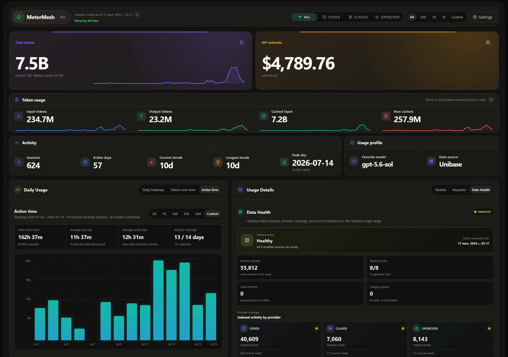

# MeterMesh

MeterMesh is a local, privacy-conscious usage dashboard for Codex, Claude Code, and OpenCode. It incrementally imports usage metadata into one app-owned SQLite index named **Unibase**, deduplicates overlapping live and backup sources, and serves Usage, Requests, and Data Health from committed SQL projections.



## Highlights

- Provider selector: All, Codex, Claude, OpenCode.
- Usage charts and provider-qualified model totals.
- Independent visualization ranges with daily, weekly, and monthly token buckets.
- Provider-aware Data Health with index integrity, coverage, and source freshness.
- Privacy-safe Requests with numbered pagination and grouping from 1 minute to 24 hours.
- Settings for source and model filtering, All-scope aggregation, reset, and Full reindex.
- Retained provenance: disabling one duplicate backup does not remove an event still supported by another source.
- Recorded OpenCode costs remain distinct from pricing estimates and unavailable costs.

## Unibase

The default database is:

```text
~/.metermesh/unibase.sqlite3
```

Override it with `METERMESH_UNIBASE_DB` or `--unibase-db`. Unibase is a rebuildable index. Provider files remain the source of truth and are opened read-only.

MeterMesh never resets or migrates `~/.codex/state_5.sqlite` or OpenCode's `opencode.db`. The old Claude `~/.claude/usage-dashboard.sqlite` is left untouched and is not used by MeterMesh 2.x.

## Data Sources

Defaults:

```text
Codex:    ~/.codex/sessions/**/rollout-*.jsonl
Claude:   ~/.claude/projects/**/*.jsonl
OpenCode: $XDG_DATA_HOME/opencode/opencode.db
          or ~/.local/share/opencode/opencode.db
```

For the live Codex source, MeterMesh also imports valid absolute rollout paths registered in `state_5.sqlite`. This automatically includes additional Codex profiles such as `~/.codex-work/sessions` without storing their raw paths in Unibase.

Compatibility overrides:

```text
CODEX_USAGE_DB / --db
CLAUDE_PROJECTS_DIR / --claude-projects
OPENCODE_USAGE_DB / --opencode-db
```

`--claude-db` remains accepted for one transition release but does not select the Unibase path.

## Backup Snapshots

MeterMesh creates an `add_stat` directory for every provider:

```text
~/.codex/add_stat/
~/.claude/add_stat/
<opencode-data-dir>/add_stat/
```

Recommended immutable snapshot layout:

```text
20260701T120000Z--before-reset--8f31a2c4/
├── snapshot.json
└── root/
```

Example manifest:

```json
{
  "format": "metermesh-provider-snapshot",
  "version": 1,
  "id": "stable-snapshot-id",
  "provider": "codex",
  "created_at": "2026-07-01T12:00:00Z",
  "label": "Before reset",
  "root": "root"
}
```

Legacy full copies placed directly under `add_stat` are detected only at fixed safe roots. New backups are registered unchecked. Legacy copies require two stable inventory observations before import.

## Privacy

Unibase stores usage metadata, hashed stream/event identities, token components, model/provider identifiers, cost semantics, and source provenance. It does not store prompts, responses, tool output, cwd, attachments, project paths, session titles, credentials, auth tokens, or account identity.

Requests and Settings APIs omit raw provider IDs and absolute source paths. Source errors are sanitized.

## Run

Requirements: Node.js 20+ and Python 3.10+.

```bash
npm install
npm run dev:all
```

Open <http://127.0.0.1:8765>.

On macOS, `Start MeterMesh.command` starts both the Python API and Vite frontend.

Direct API server:

```bash
python3 dashboard_api.py --host 127.0.0.1 --port 8766
```

### Run in Docker

`Dockerfile` + `docker-compose.yml` give you a sandboxed one-command runtime: provider sources bind-mounted read-only, Unibase in an isolated volume, host port bound to `127.0.0.1`.

Requires Docker 24+ (or Docker Desktop) with Compose v2.

```bash
docker compose up -d
```

Open <http://127.0.0.1:8765>.

#### Path mapping

Provider sources are bind-mounted **read-only** from your host into fixed in-container paths. The compose file wires the defaults; override the host side of each mount (left of `:`) if your data lives elsewhere.

| Host path | Container path | Env var | What it is |
|-----------|----------------|---------|------------|
| `~/.codex` | `/data/sources/codex` | `CODEX_USAGE_DB=/data/sources/codex/state_5.sqlite` | Codex live source + `add_stat/` backups |
| `~/.claude` | `/data/sources/claude` | `CLAUDE_PROJECTS_DIR=/data/sources/claude/projects` | Claude `projects/**/*.jsonl` + `add_stat/` backups |
| `~/.local/share/opencode` | `/data/sources/opencode` | `OPENCODE_USAGE_DB=/data/sources/opencode/opencode.db` | OpenCode live source + `add_stat/` backups |
| — (named volume) | `/data/unibase` | `METERMESH_UNIBASE_DB=/data/unibase/unibase.sqlite3` | Rebuildable index, only writable path |

The container paths and env vars are fixed by the image; only the host side of the bind mounts needs adjusting.

#### Custom source paths

If your provider data is not under the defaults, edit the `volumes` block in `docker-compose.yml`:

```yaml
volumes:
  - metermesh-unibase:/data/unibase
  - /opt/codex:/data/sources/codex:ro          # ← your Codex dir
  - /srv/claude:/data/sources/claude:ro        # ← your Claude dir
  - /var/lib/opencode:/data/sources/opencode:ro # ← your OpenCode data dir
```

To point Unibase at a host directory instead of a named volume (so you can inspect or back it up):

```yaml
volumes:
  - ./unibase:/data/unibase
  # …source mounts unchanged…
```

#### Pre-create `add_stat/` directories

MeterMesh defensively calls `mkdir(exist_ok=True)` on each provider's `add_stat/` directory at startup. Against a read-only bind mount, `os.mkdir` raises `EROFS` *before* Python can check existence — so the directories must already exist on the host:

```bash
mkdir -p ~/.codex/add_stat ~/.claude/add_stat ~/.local/share/opencode/add_stat
```

These directories are documented under [Backup Snapshots](#backup-snapshots) and are safe to leave empty.

#### Sandbox guarantees

| Concern | Mitigation |
|---------|------------|
| Writes to provider sources | Blocked — bind-mounted `:ro` |
| Network exposure | Host port bound to `127.0.0.1:8765` only |
| Privilege escalation | `no-new-privileges`, `cap_drop: ALL`, non-root uid 10001 |

#### Updating to a new MeterMesh version

The version (`package.json`) and SPA (`dist/`) are baked in at build time; the container does no runtime git fetch.

```bash
git checkout main && git pull origin main          # latest, or:
git fetch && git checkout v2.3.0                  # pin a tag

docker compose build                               # rebuild image
docker compose up -d                               # recreate container
```

Unibase and the source bind mounts survive the rebuild. If a new version changes the schema, trigger **Full reindex** in Settings, or `docker compose down -v` to start fresh.

- Run `docker compose build --pull` periodically to refresh the pinned base images against security patches, independent of MeterMesh releases.

## Settings And Maintenance

- **Apply** persists source, model, and All-scope aggregation preferences with optimistic revision checking.
- **Reset Unibase** requires `RESET UNIBASE`, preserves settings and source registry, and blocks automatic indexing until Full reindex.
- **Full reindex** builds a staging Unibase from live sources and enabled backups, runs invariants and `PRAGMA integrity_check`, then atomically swaps the database.
- Usage, Requests, and Data Health continue reading the previous committed database while staging is built.

## API

```text
GET  /api/usage
GET  /data.json              compatibility alias
GET  /api/requests
GET  /api/settings
POST /api/settings
POST /api/unibase/reset
POST /api/unibase/reindex
GET  /api/unibase/status
```

The default provider scope is `all`. Explicit `provider=codex`, `provider=claude`, and `provider=opencode` links remain supported.

## Verification

```bash
python3 -m unittest discover -s tests -p 'test_*.py' -v
node --test tests/*.test.mjs
npm run build
npm run check
```

`npm run check` uses configured local provider data. Unit tests use synthetic privacy-safe fixtures.

## License

MIT. See [LICENSE](LICENSE).
