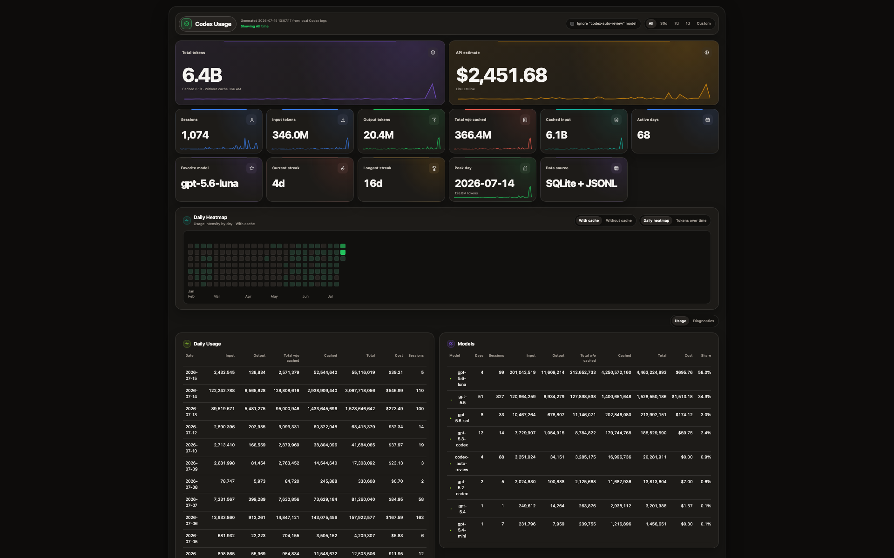

# Codex + Claude Usage Dashboard

Local web dashboard for Codex and Claude Code usage statistics. Switch between providers to view sessions, token usage, model breakdowns, a daily heatmap, and a stacked token chart by model.

This project is not affiliated with OpenAI or Anthropic.



## Features

- Local-only dashboard served on `127.0.0.1`
- `CODEX` / `CLAUDE` provider switch with one shared dashboard interface
- Incremental Claude JSONL index that imports only new transcript data into a local SQLite database
- Warm graphite telemetry-console interface with responsive hero metrics and compact daily sparklines
- Billion-scale compact values in cards and charts while detailed tables preserve full token counts
- Summary cards for sessions, token usage with and without cached input, API-equivalent cost estimate, active days, streaks, peak day, and favorite model
- Daily usage table with input, output, total without cached input, cached input, total with cached input, and estimated cost
- Model breakdown table with expandable daily model details and estimated cost by model
- Visualization tabs for daily heatmap and stacked tokens-over-time bar chart, with one shared `With cache` / `Without cache` accounting control
- Tokens-over-time chart split by model, with independent all-time, 1-year, 6-month, 90-day, 30-day, and custom date filters
- Adaptive chart buckets: daily through 60 days, weekly through 6 months, and monthly for longer ranges
- Range filters: all time, 30 days, 7 days, 1 day, and custom dates
- Optional filter to ignore the `codex-auto-review` model; auto-review data is included by default
- Deduplicated rollout telemetry that avoids counting unchanged cumulative snapshots as new model usage
- Optional `Diagnostics` workspace for inspecting replay rates and estimated local overcount without adding columns to the main Usage tables
- Loading indicators with elapsed time for longer local-history scans
- macOS `.command` launcher

## Data Sources

The dashboard reads:

```text
~/.codex/state_5.sqlite
~/.codex/sessions/**/rollout-*.jsonl
~/.claude/projects/**/*.jsonl
```

Claude usage metadata is indexed locally into:

```text
~/.claude/usage-dashboard.sqlite
```

It uses `state_5.sqlite` to discover Codex threads and rollout paths. Token counts are reconstructed from rollout telemetry in chronological order:

1. Exact `raw_response_completed.token_usage` records are preferred when present and deduplicated by response ID.
2. Otherwise, the dashboard uses component deltas from cumulative `token_count.info.total_token_usage` snapshots.

Unchanged cumulative snapshots are treated as telemetry replays and add zero usage. Classification starts at the beginning of each selected rollout before date filters are applied, so a first dashboard launch or a limited date range still receives the correct cumulative baseline.

### Claude Code indexing

For Claude Code, the dashboard scans project and subagent JSONL transcripts for assistant records containing `message.model`, `message.usage`, `sessionId`, `timestamp`, and `uuid`. It stores usage metadata only; prompts, responses, tool inputs, working directories, and attachments are not copied into the SQLite index.

Each source file has a persisted byte offset. Subsequent dashboard loads process only appended JSONL lines and newly discovered files. Event UUIDs are unique in SQLite, so repeated records do not inflate usage. Removed or truncated transcript files are reconciled on the next index pass.

Displayed token accounting follows the same practical convention used by local usage tools:

```text
Input = input_tokens - cached_input_tokens
Output = output_tokens
Total w/o cached = Input + Output
Cached = cached_input_tokens
Total = Input + Cached + Output
```

The historical dashboard total is preserved as `Total w/o cached`. The `Total` column includes cached input so you can see the full token volume represented in local logs. For Claude, `Cached` combines cache-creation and cache-read tokens; the top summary shows the two values separately.

### Codex 5.6 compatibility

Version 1.1 adds telemetry compatibility for Codex models in the `gpt-5.6-*` family and prevents repeated local snapshots from inflating usage and cost estimates. The `Usage / Diagnostics` control above the tables opens an optional audit view with raw events, deduplicated updates, replay rate, and estimated local overcount.

These diagnostics analyze locally persisted rollout events. They may explain a gap between local raw-event sums and upstream statistics, but they do not prove whether a request was accepted, rejected, or billed by OpenAI. The dashboard remains a local usage estimator rather than a server billing ledger.

## Cost Estimates

The dashboard estimates API-equivalent USD cost from token counts. It uses the current LiteLLM pricing database when the dashboard loads:

```text
https://raw.githubusercontent.com/BerriAI/litellm/main/model_prices_and_context_window.json
```

If the pricing file cannot be fetched, the dashboard falls back to bundled prices for known Codex and Claude models.

Cost accounting follows the same practical formula used by local usage tools:

```text
Cost = Input * input price
     + Cache creation * cache-write price
     + Cache read * cache-read price
     + Output * output price
```

These values are estimates only. They are not your actual OpenAI or Anthropic subscription bill.

Because prices are fetched at dashboard load time, historical days are recalculated with the current price table. If a model's API price changes later, the estimated cost for older dates can change too.

## Privacy

The app runs locally and binds only to `127.0.0.1`.

The frontend receives aggregate usage data only. It does not expose thread titles, prompts, working directories, file paths, or message contents through the normal dashboard API.

Do not run this bound to a public interface unless you have reviewed the code and understand what your local logs contain.

## Requirements

- macOS, Linux, or Windows
- Node.js 20+
- Python 3.10+
- Local Codex logs in `~/.codex`, Claude Code logs in `~/.claude/projects`, or both

On Windows, `~/.codex` and `~/.claude` resolve under `%USERPROFILE%`.

The launcher and smoke-check try `python` first, then `python3`. You can also override the interpreter with the `PYTHON` environment variable.

## Install

```bash
git clone https://github.com/Greenleaf77/Greenleaf-codex-dashboard.git
cd Greenleaf-codex-dashboard
npm install
```

## Update

If you already downloaded an older release, update from the project directory:

```bash
git pull
npm install
```

Then start the dashboard again:

```bash
npm start
```

To install a specific release instead of the latest `main`, use a tag:

```bash
git fetch --tags
git checkout v1.1.0
npm install
```

## Run

```bash
npm start
```

Then open:

```text
http://127.0.0.1:8765/
```

The runner starts:

- Vite frontend on `127.0.0.1:8765`
- Python API on `127.0.0.1:8766`

Stopping the runner with `Ctrl+C` stops both processes.

## macOS Launcher

On macOS you can double-click:

```text
Start Codex Usage Dashboard.command
```

The launcher installs npm dependencies on first run, starts the dashboard, and opens your default browser.

## Scripts

```bash
npm start      # Start Vite + Python API
npm run dev    # Start only Vite
npm run check  # Smoke-check Codex data loading
npm run build  # Build frontend assets
```

## Troubleshooting

### Port already in use

The dashboard uses ports `8765` and `8766`.

If startup fails with `EADDRINUSE`, another dashboard instance is probably still running. Close the previous terminal window or stop the process using the port.

On macOS:

```bash
lsof -nP -iTCP:8765 -sTCP:LISTEN
lsof -nP -iTCP:8766 -sTCP:LISTEN
```

### No data appears

Check that Codex has local logs:

```bash
ls ~/.codex/state_5.sqlite
ls ~/.codex/sessions
```

Then run:

```bash
npm run check
```

## Publishing Your Own Fork

From this directory:

```bash
git init
git add .
git commit -m "Initial open-source release"
gh repo create codex-usage-dashboard --public --source . --remote origin --push
```

Replace the repo name if you want a different GitHub URL.

## License

MIT
